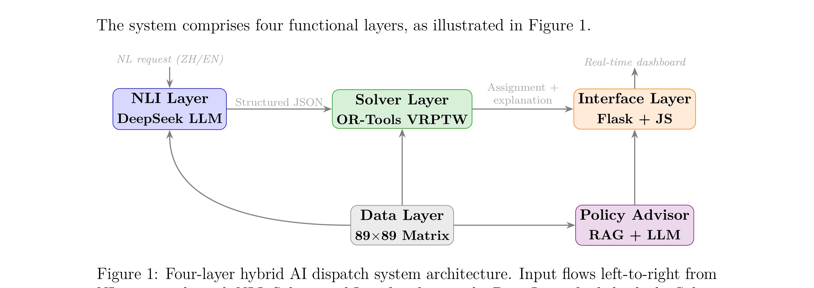
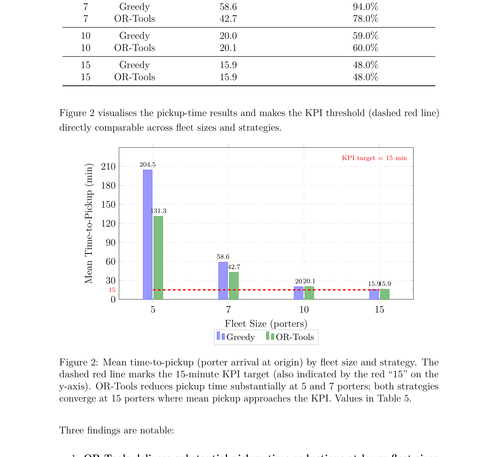

# AI-Driven Hospital Porter Dispatch System

**HKUST IEDA Final Year Project · 81,349 real 2024 hospital porter records · Hong Kong**

A production-style hybrid AI system that slashes hospital porter pickup response time by **35.8%** over rule-based dispatch. Natural-language requests (Chinese or English) feed a DeepSeek LLM parser → Google OR-Tools VRPTW optimizer → RAG policy advisor, all backed by a real historical dataset and validated by discrete-event simulation.

---

## Results at a Glance

| Metric | Result |
|--------|--------|
| Pickup response time vs. greedy (5-porter fleet) | **−35.8%** · 131.3 min → 204.5 min (greedy) |
| Pickup response time vs. greedy (7-porter fleet) | **−27.1%** · 42.7 min → 58.6 min (greedy) |
| Mean pickup time — 15-porter fleet + OR-Tools | **15.9 min** (hospital KPI target: 15 min) |
| NLP location parse accuracy (Chinese + English) | **100%** across 100 test samples, zero parse failures |
| NLP all-field accuracy (5 fields simultaneously) | **84%** · zero-shot, no training data |
| Baseline pickup KPI violation rate (historical) | **41.3%** under manual radio dispatch |
| Dataset size | **81,349** real 2024 porter task records |

---

## The Problem

Hong Kong hospital **HHH** operates 89 departments and a hard KPI: a porter must arrive at the pickup location within **15 minutes** of a request. Under the existing system, a human coordinator manually radios porters one task at a time — with no real-time visibility of porter locations and no look-ahead optimization. Analysis of 81,349 historical tasks reveals a **41.3% pickup KPI violation rate**, with a mean pickup time of 35.6 minutes.

The core dispatch failure is a combinatorial one: assigning the right porter to the right task, across a dynamic multi-porter fleet, cannot be solved optimally by human intuition or nearest-available heuristics alone.

---

## System Architecture



The system is structured as four layers:

1. **NLI Layer (DeepSeek LLM)** — Converts free-text requests in Chinese or English into structured task JSON (`from`, `to`, `service`, `priority`, `equipment`, `stops`, `scheduled_at`). Zero-shot prompt design; no training data required. Validated at 100% location accuracy, 84% all-field accuracy across 100 test samples.

2. **Solver Layer (OR-Tools VRPTW)** — Treats dispatch as a Vehicle Routing Problem with Time Windows. Evaluates all pending tasks and all available porters simultaneously. Re-optimizes on every task arrival and porter completion event (rolling-horizon). Falls back to greedy if OR-Tools is unavailable.

3. **Data Layer (89×89 Travel-Time Matrix)** — Derived from historical p75 porter journey times across all 89 department pairs. Floor-based fallback for sparse pairs; global p90 fallback for unknown pairs.

4. **Policy Advisor (RAG + LLM)** — Retrieves the 10 most similar historical tasks from 81,349 records via weighted field-matching, then uses an LLM to synthesize a KPI risk assessment (Low / Medium / High) and fleet policy recommendations.

**Frontend:** Flask REST API + Vanilla JS + Tailwind CSS dashboard. Real-time porter status, dispatch history, advisor panel. No build step required.

---

## Key Results



OR-Tools' advantage is greatest under moderate resource constraints — the realistic operating regime for a hospital fleet:

- At **5 porters**: OR-Tools reduces mean pickup time from 204.5 → 131.3 minutes (**−35.8%**).
- At **7 porters**: 58.6 → 42.7 minutes (**−27.1%**).
- At **10 porters**: both strategies converge (~20 min), showing diminishing returns when the fleet is adequately resourced.
- At **15 porters**: mean pickup ≈ **15.9 min** — the KPI target is achievable with the right fleet size and optimizer.

> **Interpretation:** OR-Tools eliminates suboptimal "greedy" assignments that ignore pending tasks. When resources are scarce, globally optimal assignment meaningfully changes outcomes. When resources are abundant, any nearby porter is close enough.

---

## NLP Accuracy (n=100, zero parse failures)

| Field | Accuracy |
|-------|----------|
| Origin location | **100.0%** |
| Destination location | **100.0%** |
| Service classification | 98.0% |
| Infection control flag (VRE, NEATS) | 98.0% |
| Priority extraction | 88.0% |
| **All 5 fields correct** | **84.0%** |

All 12 priority errors follow a single pattern: `即時` ("immediate") parsed as Normal instead of Urgent — fixable with one disambiguation rule in the system prompt. Location accuracy at 100% is the critical result: the system can always route the porter correctly.

Test methodology: 100 natural-language sentences reconstructed from real historical records (no labelled sentence data existed); structured output compared to ground truth.

---

## Tech Stack

| Component | Technology |
|-----------|-----------|
| Language | Python 3.11 |
| Web framework | Flask |
| NLP / LLM | DeepSeek (`deepseek-chat`) via OpenAI-compatible API |
| Optimizer | Google OR-Tools (VRPTW, Guided Local Search) |
| Data processing | pandas, openpyxl |
| Frontend | Vanilla JS, Tailwind CSS (CDN) |
| Simulation | Custom discrete-event simulation (Poisson arrivals) |
| Data | 81,349 real 2024 hospital porter task records |

---

## Quick Start

```bash
git clone https://github.com/adamchoi787/porter-dispatch-prototype.git
cd porter-dispatch-prototype

python -m venv .venv
source .venv/bin/activate   # Windows: .venv\Scripts\activate

pip install -r requirements.txt

# Add your DeepSeek API key (get one at platform.deepseek.com)
echo "OPENAI_API_KEY=your-key-here" > .env

python app.py
# Open http://localhost:5000
```

### Try it out

Type any of these into the dashboard input box:

```
Super urgent patient from A&D to SDU
VRE patient from 6H to 5L
Send a patient from 7H to 3FXRAY, then continue to ICU
緊急病人從A&D到5L
Schedule specimen transport from 化驗室 to 7H at 14:30
```

### Run the simulation

```bash
# Compare greedy vs OR-Tools across fleet sizes (synthetic mode, 8-min inter-arrival)
python simulation.py --mode synthetic --tasks 100 --porters 5 7 10 15 --interval 8.0

# Replay historical tasks
python simulation.py --mode replay --tasks 200 --porters 3 5 7
```

### Run NLP accuracy test

```bash
python nlp_accuracy_test.py --samples 100 --output nlp_accuracy_results.csv
# Note: requires DATA2024.xlsx in the parent directory (not included — private hospital data)
```

---

## Repository Structure

```
porter-dispatch-prototype/
├── app.py                     # Flask REST API (9 endpoints)
├── porter_prototype.py        # Core dispatch logic: Porter, PorterDispatchSystem, LLM
├── solver.py                  # OR-Tools VRPTW solver + greedy fallback
├── advisor.py                 # RAG policy advisor (HistoricalTaskStore + PolicyAdvisor)
├── simulation.py              # Discrete-event simulation harness
├── nlp_accuracy_test.py       # NLP validation against reconstructed historical sentences
├── kpi_analysis.py            # Pickup-time KPI analysis across fleet sizes
├── simulation_results.csv     # Pre-run simulation output
├── nlp_accuracy_results.csv   # NLP test results (n=100)
├── kpi_analysis.md            # Pickup-time analysis report
├── static/
│   └── index.html             # Dashboard frontend (Vanilla JS + Tailwind CSS)
├── travel_time/
│   └── travel_times.xlsx      # 89×89 hospital travel time matrix (p75, derived)
├── report/
│   ├── main.tex               # Full FYP report (LaTeX, 25 pages)
│   ├── main.pdf               # Compiled report PDF
│   ├── v5_fig1.png            # System architecture diagram
│   └── v5_fig2.png            # Pickup-time results chart
├── slides/
│   ├── slides.tex             # Beamer presentation source (LaTeX)
│   ├── slides.pdf             # Compiled LaTeX slides
│   └── presentation_vf2.pdf  # Final presentation deck
└── requirements.txt
```

> **Note:** `DATA2024.xlsx` (81,349 real hospital records) is excluded from this repository — it is private patient transport data. The simulation and NLP tests require it separately. The core dispatch system (Flask app + OR-Tools solver) runs without it.

---

## API Reference

| Method | Endpoint | Description |
|--------|----------|-------------|
| `GET` | `/` | Frontend dashboard |
| `POST` | `/dispatch` | Parse NL request, assign porter; body: `{"request": "..."}` |
| `GET` | `/status` | All porter states (location, status, countdown, route) |
| `POST` | `/undo` | Reverse last dispatch |
| `POST` | `/complete/<id>` | Manual task completion (testing) |
| `GET` | `/scheduled` | List pending scheduled tasks |
| `DELETE` | `/scheduled/<id>` | Cancel a scheduled task |
| `POST` | `/advisor/risk` | KPI risk for a task; body: `{"task": {...}}` |
| `GET` | `/advisor/suggestions` | LLM fleet policy suggestions |
| `POST` | `/advisor/ask` | Natural language Q&A; body: `{"question": "..."}` |

---

## Scope & Limitations

This is a **research prototype**, validated by simulation against real historical data. It is not deployed in production at HHH.

| Limitation | Detail |
|------------|--------|
| **In-memory state only** | All porter state resets on server restart. SQLite persistence is the obvious next step. |
| **Hardcoded 3-porter fleet** | The live dashboard initializes 3 porters. Simulation tests up to 15. |
| **No real-time porter location** | System updates porter location only at task assignment. GPS badges or check-in terminals would be needed for production. |
| **LLM dependency** | Natural language parsing requires the DeepSeek API. Without it, the system cannot accept NL input (structured fallback would be needed). |
| **Infection-control routing** | The LLM correctly extracts VRE/NEATS flags (98% accuracy), but the optimizer does not currently use this to constrain routing. Flagged as future work. |
| **No field trial** | Simulation uses historical arrival rates and travel times. A parallel field trial alongside existing radio dispatch would validate real-world KPI improvement. |

**What deployment would require:** (1) SQLite persistence, (2) real-time porter location input, (3) a one-month parallel field trial to validate the 15-porter fleet recommendation against actual HHH shift patterns. DeepSeek API cost at HHH's volume: ~$0.02–0.05/day.

---

## About

**HKUST IEDA FYP Project 16** — "Optimizing Portering Logistics at HHH: AI-Driven Porter Dispatch System"  
Supervisor: Prof. Xiangtong QI · Team: CHAN Hok Nam, CHOI Cheuk Man, KIM Youseung  
Submitted May 2026.

The system's novelty is the integration of three established techniques — zero-shot LLM parsing, VRPTW optimization, and RAG advisory — into a unified hospital dispatch system, validated empirically on a real operational dataset. Each component independently handles a distinct challenge: language understanding, combinatorial assignment, and data-driven risk advisory.
